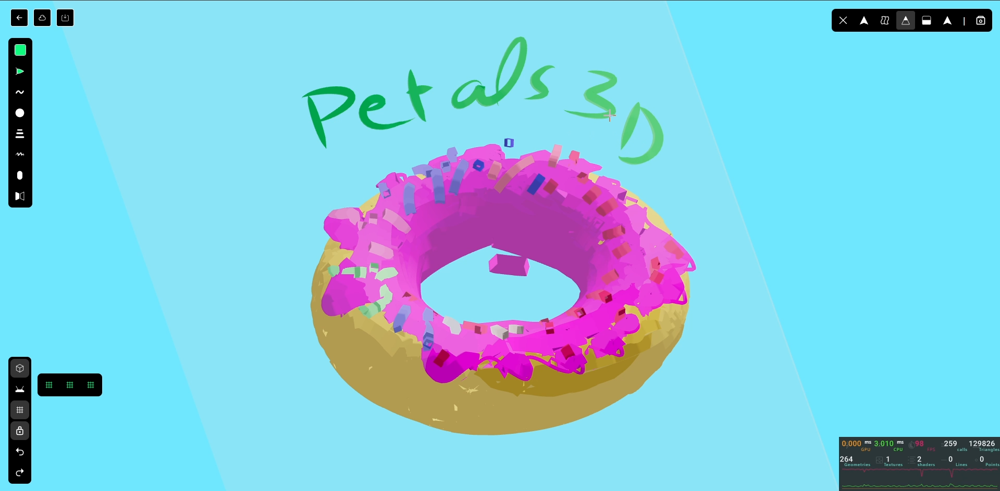

<a href="https://petals-3d.com/" target="_blank" rel="noopener">
  <picture>
    <source media="(prefers-color-scheme: dark)" alt="Petals 3d" />
    
  </picture>
</a>

  <h2>
    An open source 3d hand-drawn style whitebox 
   
  </h2>

  <figure>
    
    <figcaption>
      

        Create beautiful hand-drawn 3d drawings, models, or whatever you like.
      

    </figcaption>
  </figure>

## Features

The Petals 3D editor (npm package) supports:

-   💯&nbsp;Free & open-source.
-   🎨&nbsp;Infinite, 3d canvas-based whitebox.
-   ✍️&nbsp;Hand-drawn like style.
-   📷&nbsp;Image support.
-   😀&nbsp;Arbitary and Primitive Shapes.
-   🌐&nbsp;Localization (i18n) support.
-   🖼️&nbsp;Export to GLTF.
-   💾&nbsp;Local-first support (autosaves to the browser).
-   🔙&nbsp;Undo / Redo.

## Tutorials

The Petals 3D editor has small learning curve below are the YT links for understanding how to draw in 3d

-   &nbsp;Draw Donut - https://youtu.be/YLIo-D7Neu4
-   &nbsp;Draw Cafe - https://youtu.be/7K2tw7Xst64
